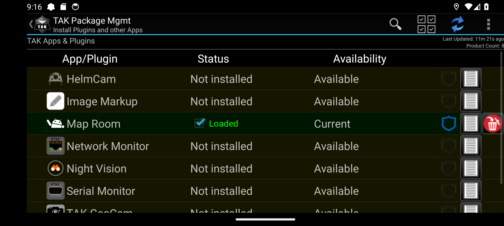
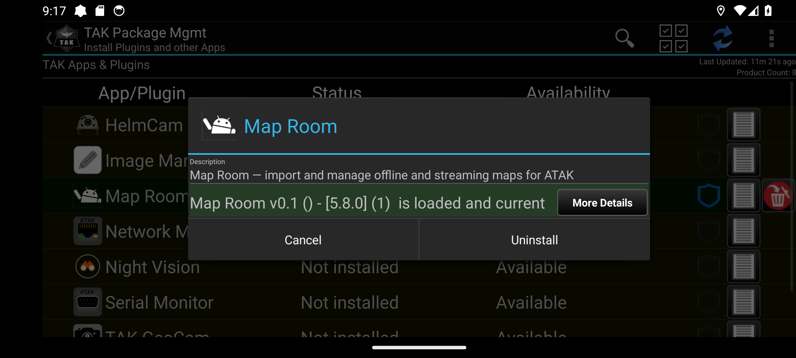
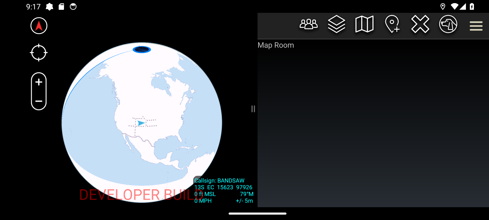

# ATAK plugin dev container

A container with everything an ATAK 5.8 plugin build needs, so you are not
chasing JDK versions, Android SDK components and Gradle distributions on your
own machine. It builds the plugin, installs it to an emulator or device, and
gets it loaded into ATAK.

The ATAK SDK itself is **not** in the image. It is licensed material; you
download your own from [tak.gov](https://tak.gov) and mount it.

---

## Read this first: the signing gate

This is the one thing that will cost you an afternoon if you skip it.

ATAK compares a plugin's signing certificate against its own. Your plugin is
signed with the SDK's `android_keystore` (`O=WinTec Arrowmaker`). The **release**
ATAK-CIV from tak.gov or the Play Store is signed with a different key, so it
refuses your plugin. What you see:

- the plugin manager lists it as **Incompatible**
- logcat says `AtakPluginRegistry: signature mismatch[your.package]`
  followed by `will NOT load`

The fix is not to re-sign anything. **Install the ATAK APK that ships inside the
SDK** — `atak.apk` at the SDK root. It is the same 5.8.0.1 build, signed with
the same key as your plugin, and it logs `SDK skipping signature check` instead.
You will see a red `DEVELOPER BUILD` watermark on the map; that is how you know
you are on the right one.

```bash
adb uninstall com.atakmap.app.civ          # release and dev builds cannot coexist
adb install -r "$ATAK_SDK_DIR/atak.apk"
```

Two consequences worth being deliberate about:

- **Uninstalling wipes app data.** Files under `/sdcard/atak` survive (it is a
  top-level directory), but ATAK's registrations and preferences do not — your
  imported maps will be on disk and not showing. If the previous install had
  encrypted databases, first launch will demand a passphrase you do not have;
  choose **Remove and Quit**, confirm, and relaunch.
- **The dev build skips a security check.** Anything you verify about plugin
  behaviour from here is verified on a permissive build. That is right for
  iterating and is not evidence about what real users on the release build get.

To ship to users on the release build you need a signed APK from TAK's
**Third Party Pipeline** — see [Shipping](#shipping-getting-a-signed-apk).

---

## Setup

You need Docker with Compose, and an emulator or device on the host.

```bash
git clone <this repo> && cd atak-plugin-dev
cp .env.example .env
$EDITOR .env                      # point ATAK_SDK_DIR at your unzipped SDK
docker compose up -d --build      # first build pulls ~2 GB of Android SDK
```

`.env` holds machine layout only — no secrets:

| Variable | What it is |
| --- | --- |
| `ATAK_SDK_DIR` | Folder that directly contains `atak.apk`, `android_keystore`, `atak-gradle-takdev.jar`. Mounted **writable** — the takdev gradle plugin writes `mapping.txt` into it. |
| `ANDROID_USER_HOME` | Your `~/.android`, so the emulator does not re-prompt to authorise adb. |
| `ADB_SERVER_SOCKET` | How the container reaches the host adb server. |

### adb

The container does not run its own adb server; it talks to the host's, so both
see the same device. adb only listens on a non-loopback interface when it is
started explicitly with `-a`, which means **you have to start it yourself** —
a client auto-spawning the server will not do it:

```bash
./bin/host-adb-server        # on the host, in its own terminal, leave running
```

Then, in the container:

```bash
docker compose exec atak-dev bash
adb devices                  # should list your emulator
```

If it does not: on native Linux Docker with `network_mode: host`,
`host.docker.internal` may not resolve even with the `extra_hosts` mapping.
Set `ADB_SERVER_SOCKET=tcp:127.0.0.1:5037` in `.env` and recreate the container.

---

## The loop

Start from the SDK's template, which is the only shape the build system and the
signing pipeline both expect:

```bash
cp -r "$ATAK_SDK_DIR/samples/plugintemplate" workspace/MyPlugin
cd workspace/MyPlugin
cp template.local.properties local.properties
```

Edit `local.properties` — it is per-project, is not committed, and a fresh
clone fails confusingly without it:

```properties
sdk.dir=/opt/android-sdk
sdk.path=/opt/atak-sdk
takdev.plugin=/opt/atak-sdk/atak-gradle-takdev.jar
```

Then, from inside the container:

```bash
/work/bin/deploy MyPlugin
```

That assembles `CivDebug`, installs the APK, and stages a copy in
`/sdcard/atak/support/apks/sideloaded/` — which is the part that is not
obvious. **Installing the APK is not enough.** ATAK's plugin manager lists
products from its repositories, and a sideloaded plugin only becomes one of
them when a copy is in that folder and you sync:

> hamburger menu → **Tools** → **Plugins** → sync icon (top right) → **OK**
> → tap the plugin's row → **Load** → **OK**

Status goes `Not loaded` → `Loaded`, and the plugin appears in the Tools drawer.

The plugin manager after a sync — yours is listed alongside the products from
TAK's own repositories, and the sync control is the blue arrows, top right:



Tapping the row shows its state. `is loaded and current` is what you want; if
it says **Incompatible**, go back to
[the signing gate](#read-this-first-the-signing-gate):



Once loaded it appears in the Tools drawer and opens its own pane. Note the
red `DEVELOPER BUILD` watermark — that is how you know you are on the SDK's
ATAK and not the release one:



### Rename the template before you write any code

The template builds as `com.atakmap.android.plugintemplate.plugin` and displays
as "Plugin Template". Renaming later is worse than renaming now. Touch:

- `namespace` in `app/build.gradle`
- the java package directories, and the class implementing `IPlugin`
- `impl=` in `app/src/main/assets/plugin.xml`
- `app_name` and `app_desc` in `app/src/main/res/values/strings.xml`
- `rootProject.name` in `settings.gradle` — this drives the APK name **and**
  the proguard `-repackageclasses atakplugin.<name>` line the signing pipeline
  requires be specific to your plugin

Keep the `com.atakmap.app.component` activity in `AndroidManifest.xml`. It is
what makes the plugin discoverable; removing it makes it invisible with no
error. After renaming, uninstall the old package **and** delete its APK from
the sideload folder, or Sync Packages will show a phantom second product.

---

## Where plugins live

Each plugin is its own repository, cloned into `workspace/` — which is mounted
at `/work` and is otherwise ignored by this repo. Nothing under `workspace/`
belongs to the container except `workspace/bin`.

```bash
git clone <your-plugin-repo> workspace/MyPlugin
docker compose exec atak-dev /work/bin/deploy MyPlugin
```

A worked example, built with this container:
[Map Room](workspace/MapRoom) — installs a catalogue of map sources and
gets them rendering in ATAK.

## Testing

`./gradlew testCivDebugUnitTest` runs local JVM tests — use these for anything
that does not touch the Android or ATAK API. They run in seconds.

For anything that does, the SDK ships an Espresso framework. Copy `espresso/`
from the SDK so it sits beside `app/`, derive test classes from
`ATAKTestClass`, and call `helper.installPlugin("Your Plugin Name")` plus
`ClassLoaderReplacer.fixClassLoaderForClass(...)` in a `@BeforeClass` — plugins
run inside ATAK's process, so without the classloader fix you get
`ClassDefNotFoundException` on your own classes. Run with
`./gradlew connectedCivDebugAndroidTest`. Both the plugin and the developer
ATAK APK must be installed first.

Turn off animations or Espresso will be flaky:

```bash
adb shell settings put global window_animation_scale 0
adb shell settings put global transition_animation_scale 0
adb shell settings put global animator_duration_scale 0
```

**Debugging:** plugins have no activity of their own, so you attach to the
running ATAK process (`com.atakmap.app`) rather than launching. Breakpoints in
plugin source resolve once attached.

---

## Shipping: getting a signed APK

Real users run the release ATAK, which will not load an unsigned plugin. TAK's
Third Party Pipeline builds and signs third-party plugins; you upload a zip at
<https://tak.gov/user_builds/agreement>. Plugins it signs are marked in the UI
as third-party-signed rather than TPC-built.

All of its requirements are checkable locally before you submit:

| Requirement | Check |
| --- | --- |
| Zip with a **single root folder**; that name becomes the APK name | `zip -r MyPlugin.zip MyPlugin` from the parent directory |
| Gradle build, scripts included | inherited from the template |
| **`assembleCivRelease` must exist and succeed** | `./gradlew assembleCivRelease` — the discriminating check; run it early |
| SDK referenced only through `atak-gradle-takdev` | the 5.8 template uses `takdevVersion = '3.+'`. The published guidance says `2.+` for ATAK 4.2+, but also states a recent template clone already satisfies the requirement — leave the template's value alone |
| `-repackageclasses` names your plugin | the template derives it from `rootProject.name`; just set that |
| `com.atakmap.app.component` activity in the manifest | present in the template — do not remove it |

Access to `artifacts.tak.gov` for a pre-submission verification build is
restricted to USG personnel; without it, a clean local `assembleCivRelease` is
the best signal you can get.

---

## What is in the image

| | |
| --- | --- |
| JDK | Temurin 17 |
| Android | cmdline-tools, platforms 36 and 34, build-tools 36.0.0, platform-tools |
| Gradle | 8.14.3, pre-seeded so the first build does not download it |
| Also | git, curl, unzip, jq, python3, vim, nano, procps, net-tools |

Runs as `dev` (uid 1000) with passwordless sudo. It is a personal dev box, not
a hardened CI image — install what you need.

The NDK is **not** included. ATAK's own native libraries are built with NDK
12b, and plugins that link against them should match; add it via `sdkmanager`
or set `ndk.dir` if you need JNI.

---

## Troubleshooting

| Symptom | Cause |
| --- | --- |
| Plugin manager says **Incompatible** | Release ATAK installed. Use the SDK's `atak.apk`. |
| `signature mismatch` in logcat | Same. |
| `will NOT load` but no signature error | Detected but not enabled — sync, tap the row, **Load**. |
| Plugin not listed at all after install | Not staged in `/sdcard/atak/support/apks/sideloaded/`, or you have not synced. |
| `adb devices` empty in the container | Host adb server not started with `-a` (`./bin/host-adb-server`), or `host.docker.internal` does not resolve. |
| `mapping.txt (Read-only file system)` | SDK mount is read-only; takdev writes into it. Drop any `:ro`. |
| Gradle fails offline | The gradle *distribution* is pre-seeded, dependencies are not. The first build needs network. |
| First launch demands an encryption passphrase | Left over from a previous install. **Remove and Quit**, confirm, relaunch. |
| Automated first-run walkthrough loops forever | ATAK's background-location prompt opens a settings sub-screen that re-presents itself. Grant with `adb shell pm grant <pkg> android.permission.…` and `adb shell appops set <pkg> MANAGE_EXTERNAL_STORAGE allow` instead of tapping through it. |

---

## Layout

```
.env.example          machine layout, copy to .env
compose.yaml          the dev service
Dockerfile            the image
bin/host-adb-server   run on the HOST before using adb in the container
workspace/            mounted at /work — your plugin projects live here
workspace/bin/deploy  build + install + stage, run inside the container
```
